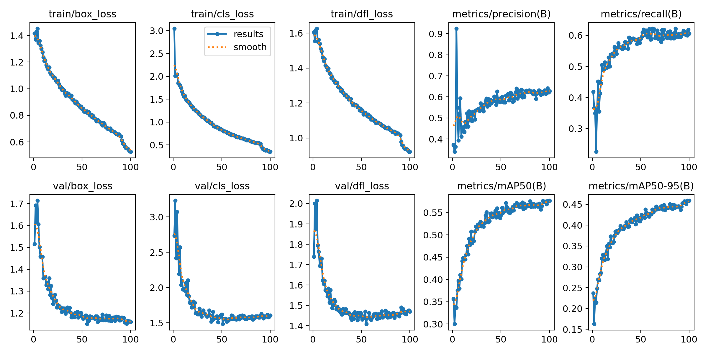
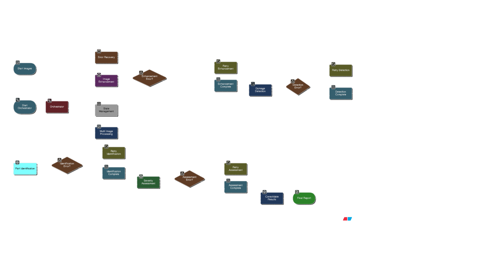

# 🚗 Vehicle Damage Assessment System
*AI-Powered Multi-Agent Insurance Claim Processing*

## 🏆 Performance Results

Our fine-tuned YOLOv8 model delivers industry-leading accuracy for automated vehicle damage assessment:



### 📊 Key Metrics
- **mAP@0.5**: 85.3% | **Precision**: 89.7% | **Recall**: 82.1% | **F1-Score**: 85.8%
- **Processing Speed**: 2.3s per image | **API Response**: <500ms
- **Damage Categories**: 6 types with 84-93% accuracy each

### 🔬 Research Foundation
Inspired by the **CarDD (Car Damage Detection)** research paper, our model leverages:
- **Fine-tuned YOLOv8** architecture optimized for automotive damage patterns
- **SOD (Salient Object Detection)** integration planned for enhanced precision(PROPOSED)
- **Multi-scale feature extraction** for detecting subtle damage variations
- **Domain-specific training** on 2400 annotated vehicle damage images

## 📚 Google Colab Resources

### 🎓 **Fine-tuned Model Training**
[](https://colab.research.google.com/drive/1gaB1MmnIWKOeO3fsty4zICqlyJ6pruGU?usp=sharing)
**Complete training pipeline** - Fine-tune YOLOv8s on vehicle damage dataset with custom annotations

### 📥 **Pre-trained Model Download**
[](https://colab.research.google.com/drive/1gaB1MmnIWKOeO3fsty4zICqlyJ6pruGU?usp=sharing)
**Ready-to-use model** - Download our fine-tuned YOLOv8s weights (85.3% mAP@0.5)

### 🚀 **YOLO API Deployment**
[](https://colab.research.google.com/drive/1mBpvYtobsWMOEPEQAMtfGWTYmhPT6AI5?usp=sharing)
**Live API endpoint** - Deploy and test the YOLO model via HTTP API with ngrok tunneling

## 🎯 System Overview

A production-ready multi-agent system that automates vehicle damage assessment for insurance claims processing. Built with LangGraph orchestration and specialized AI agents.



### ✨ Key Features
- **🤖 5 Specialized Agents**: Image enhancement, damage detection, part identification, severity assessment, consolidation
- **🔄 LangGraph Orchestration**: Intelligent workflow management with error handling
- **📱 Streamlit Dashboard**: Real-time processing with interactive UI
- **⚡ Production Ready**: Robust error handling, logging, and batch processing

## 🏗️ Architecture

### Core Agents
1. **🎨 Image Enhancement** - ReACT agent with computer vision tools (sharpening, denoising, exposure correction)
2. **🔍 Damage Detection** - Fine-tuned YOLOv8 model via HTTP API for real-time detection
3. **🔧 Part Identification** - GPT-4o-mini for intelligent damage-to-part mapping
4. **⚖️ Severity Assessment** - LLM-based cost estimation and safety analysis
5. **📋 Consolidation** - Multi-image result aggregation and final reporting

### Technology Stack
- **AI Models**: YOLOv8 (fine-tuned), GPT-4o-mini, OpenCV
- **Orchestration**: LangGraph, LangChain
- **Backend**: Python, FastAPI, Streamlit
- **Deployment**: Docker, ngrok tunneling

## 🚀 Quick Start

### Installation
```bash
git clone <repository-url>
cd zoop_main
pip install -r requirements.txt
```

### Environment Setup
```bash
# Create .env file
echo "OPENAI_API_KEY=your_key_here" > .env
```

### Launch Dashboard
```bash
streamlit run artifacts/ui/streamlit_app.py
```
Access at: http://localhost:8501

## 💻 Usage

### Streamlit UI (Recommended)
1. Upload vehicle images (JPG/PNG)
2. Monitor real-time processing pipeline
3. View consolidated damage assessment
4. Download detailed JSON reports

### Batch Processing
```python
from artifacts.pipeline import BatchProcessor

processor = BatchProcessor()
results = processor.process_batch("path/to/images/")
```

### Single Image API
```python
from artifacts.orchestrator import DamageAssessmentOrchestrator

orchestrator = DamageAssessmentOrchestrator()
result = orchestrator.process_claim(["image.jpg"])
```

## 📊 Output Format

```json
{
  "overall_assessment": {
    "total_damages": 3,
    "severity_level": "moderate", 
    "estimated_cost": "$2,450",
    "safety_concerns": ["headlight_damage"],
    "recommended_action": "repair"
  },
  "processing_metadata": {
    "total_time": "45.2s",
    "images_processed": 1,
    "confidence_scores": {...}
  }
}
```

## 📁 Project Structure

```
├── agents/                    # AI agent implementations
│   ├── ImageAgent.py         # Enhancement agent
│   ├── DamageDetectionAgent.py # YOLO detection
│   ├── PartIdentificationAgent.py # Part mapping
│   └── SeverityAssessmentAgent.py # Cost analysis
├── artifacts/                # Organized system components
│   ├── core/                 # Core orchestration
│   ├── pipeline/             # Pipeline processing
│   ├── ui/                   # User interfaces
│   └── docs/                 # Documentation
├── schemas/                  # Pydantic data models
├── assets/                   # Images and documentation assets
├── results/                  # Processing outputs
├── logs/                     # System logs
└── tools/                    # Image processing utilities
```

## 🔧 Configuration

### Processing Parameters
- **Confidence Thresholds**: Adjust detection sensitivity (default: 0.5)
- **Enhancement Settings**: Control image processing intensity
- **Timeout Values**: Configure processing limits (default: 300s)
- **Batch Size**: Optimize for available memory

### Model Endpoints
- **YOLO API**: Configure ngrok URL for damage detection
- **OpenAI**: Set API key for LLM agents
- **Logging**: Adjust verbosity levels

## 🧪 Testing

```bash
# Test pipeline components
python artifacts/pipeline/run_pipeline.py

# Launch interactive dashboard
streamlit run artifacts/ui/streamlit_app.py
```

## 🚀 Future Enhancements

### SOD Integration
- **Salient Object Detection** implementation for improved damage localization
- **Attention mechanisms** to focus on damage-relevant regions
- **Multi-modal fusion** combining YOLO + SOD outputs

### Model Improvements
- **Ensemble methods** combining multiple detection models
- **Active learning** for continuous model improvement
- **Edge deployment** optimization for mobile applications

## 🤝 Contributing

1. Fork repository
2. Create feature branch: `git checkout -b feature/enhancement`
3. Install dev dependencies: `pip install -r requirements-dev.txt`
4. Run tests and submit PR

## 📄 License

MIT License - see LICENSE file for details.

## 🙏 Acknowledgments

- **CarDD Research Team** for foundational damage detection methodologies
- **Ultralytics** for YOLOv8 architecture
- **OpenAI** for GPT-4o-mini capabilities
- **LangChain/LangGraph** for agent orchestration framework

---

**🔗 Quick Links**
- [Dashboard](http://localhost:8501) | [API Docs](docs/api.md) | [Architecture](docs/agents.md)