# Vehicle Damage Assessment - Agentic Flow

```mermaid
flowchart LR
    A[📸 Input Images] --> B[✨ Enhance]
    B --> C[🔍 Detect Damage]
    C --> D[🔧 Identify Parts]
    D --> E[⚖️ Assess Severity]
    E --> F[📋 Consolidate]
    F --> G[📊 Final Report]
    
    %% Styling
    classDef input fill:#f3e5f5,stroke:#4a148c,stroke-width:2px
    classDef process fill:#e1f5fe,stroke:#01579b,stroke-width:2px
    classDef output fill:#e8f5e8,stroke:#2e7d32,stroke-width:2px
    
    class A input
    class B,C,D,E,F process
    class G output
```

## Agent Responsibilities

### 🤖 **Image Enhancement Agent**
- **Type**: ReACT Agent (LangChain + GPT-4o-mini)
- **Role**: Intelligent image quality improvement
- **Capabilities**: Blur detection, brightness adjustment, noise reduction

### 🎯 **Damage Detection Agent**
- **Type**: YOLO-based Computer Vision
- **Role**: Identify and locate vehicle damage
- **Capabilities**: Object detection, damage classification, confidence scoring

### 🔍 **Part Identification Agent**
- **Type**: LLM-powered Analysis
- **Role**: Map damage to specific vehicle components
- **Capabilities**: Part taxonomy, damage percentage calculation

### ⚖️ **Severity Assessment Agent**
- **Type**: LLM-based Evaluation
- **Role**: Determine repair complexity and costs
- **Capabilities**: Severity classification, cost estimation, safety flagging

### 🧠 **LangGraph Orchestrator**
- **Type**: State Management System
- **Role**: Coordinate all agents and workflow
- **Capabilities**: Routing logic, error handling, result consolidation

## Key Features
- **Intelligent Routing**: Confidence-based decision making
- **Error Recovery**: Automatic retry with graceful degradation  
- **Multi-Image Processing**: Consolidates results across multiple views
- **State Management**: Maintains processing context throughout pipeline